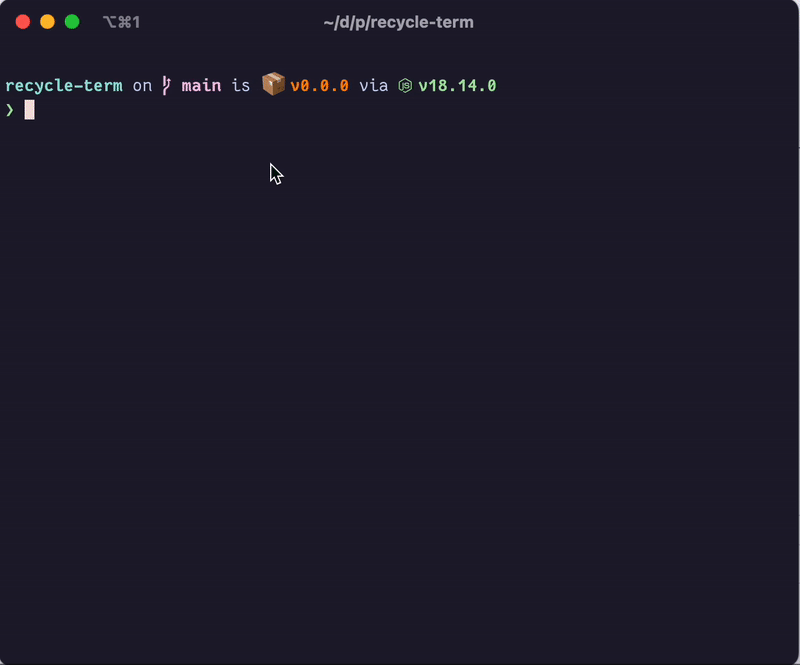

# Recycle CLI

An unofficial Recycle (https://www.recycleapp.be/) CLI to generate an iCal file.

Require NodeJS >= 16

## Features

✔ Display a notification the day before  
✔ Show the nearest Recycling-park in the agenda  
✔ Fully compliant with the iCal standard (https://www.rfc-editor.org/rfc/rfc5545)  
✔ Fully compliant with Apple Calendar, Outlook, Google Calendar, ...

## Run

```shell
npx recycle-cli
```

## Demonstration


